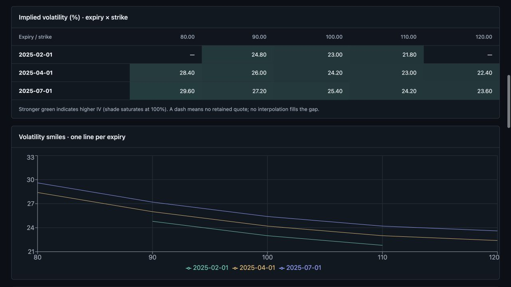
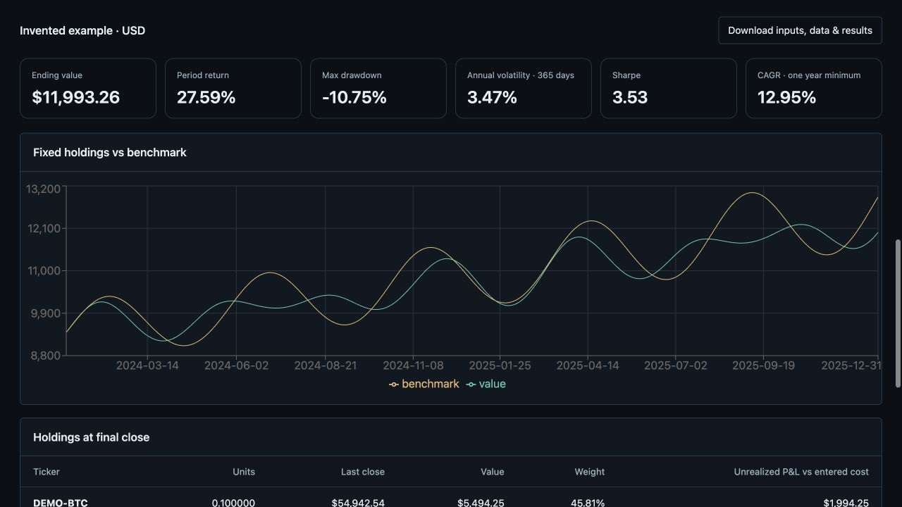

# Portfolio Tracker

[GitHub repository](https://github.com/Yeydi-code/portfolio-tracker) · [Automated checks](https://github.com/Yeydi-code/portfolio-tracker/actions)

A local financial research terminal built with React and Python. Explore portfolios, test trading rules, and turn explicit valuation assumptions into strategy scenarios. Runs on your computer; no hosted account, paid deployment, or API key is needed for the offline examples.

## What it demonstrates

| Workspace | Capabilities |
| --- | --- |
| Equity portfolios | Ticker lookup, quantities or allocation-based sizing, cash, benchmarks, return and risk analysis |
| Options Lab | Multi-leg templates, payoff/time grids, Greeks, exposure presets, borrowing assumptions, delayed chains and scenario comparisons |
| Analytics Lab | DCF, comparable multiples, football field, European BSM, American binomial pricing, futures carry, fixed-rate bullet bonds |
| Backtesting | Stock/ETF buy-and-hold and moving-average rules; next-session execution, costs, benchmarks and trade ledgers |
| Covered-call simulation | Modeled option premiums, rolling and expiry assignment over observed or invented stock history |
| Volatility | Observed strike/expiry IV grid, smiles, quote filters and a complete exclusion audit |
| Crypto | USD spot holdings, daily UTC history, 365-day risk statistics and cost-based P&L |
| Saved workspaces | Local SQLite portfolios, browser recovery drafts and exported calculation data |

Model estimates, downloaded quotes and invented examples are labeled separately. Stale results are hidden after edits. Calculation engines live in Python, with saved draft schemas separate from numerical request validation.





## Run locally

Use **Python 3.13**, **Node.js 24.19+** and **pnpm 11.25.0**. Clone `https://github.com/Yeydi-code/portfolio-tracker.git` or download and extract its source, then open a terminal in its root directory. The initial installation needs internet access; offline examples run without it afterward.

macOS / Linux:

```sh
python3.13 -m venv .venv-terminal
source .venv-terminal/bin/activate
python -m pip install -r requirements-lock.txt
pnpm --dir terminal install --frozen-lockfile
pnpm --dir terminal build
python launch_terminal.py --open
```

Windows PowerShell uses the same install/build commands after creating the environment:

```powershell
py -3.13 -m venv .venv-terminal
.\.venv-terminal\Scripts\Activate.ps1
python -m pip install -r requirements-lock.txt
pnpm --dir terminal install --frozen-lockfile
pnpm --dir terminal build
python launch_terminal.py --open
```

Open **http://127.0.0.1:8502/**. Keep the launcher running; Ctrl+C stops it. After the first build, Python is sufficient to run the compiled app. On macOS, `Start Portfolio Terminal.command` is a convenience launcher after setup; run `chmod +x "Start Portfolio Terminal.command"` if it is not executable after downloading. Port 8502 can be changed with `--port`. The server binds only to loopback and is intended for one trusted local user, not public hosting.

The exact Python dependency snapshot is `requirements-lock.txt`; `requirements-terminal.txt` and `requirements.txt` describe broader direct requirements. The frontend uses `terminal/pnpm-lock.yaml`. Compiled assets are generated locally, not committed. A clean install and all checks were verified on macOS with Python 3.13; the included GitHub workflow targets Linux. Windows instructions are provided but were not tested on a Windows machine.

## Try it in five minutes

1. **Volatility → Build volatility grid.** The default invented snapshot produces 13 retained points; blank cells show deliberately rejected quotes.
2. **Crypto → Try crypto example → Load crypto example → Analyze crypto.** Inspect period returns and unrealized P&L separately; a missing purchase cost stays unavailable.
3. **Analytics Lab → Bond Analytics → Government bond example.** Load the example and calculate: a regular 4% coupon bond at 4% yield on a coupon date prices at 100 per 100 face.
4. **Backtesting → Historical stocks & ETFs → Try offline example.** Load and run it, inspect the trades, then change costs to see their effect.
5. **Backtesting → Options strategy simulation → Try covered-call example.** These option premiums are modeled, not historical option quotes. Compare the account with holding the same stock quantity.

For a manual option example and the valuation-to-strategy workflow, see the [walkthrough](docs/walkthrough.md).

## Model scope

- Equity holdings and stock backtests use USD equities/ETFs and a 252-session risk convention. Crypto lives in a separate workspace using USD spot pairs, complete UTC days and 365-day annualization. There is no combined multi-asset accounting engine.
- DCF is a conditional valuation, not a price forecast. Transferring a DCF result to Options Lab requires an explicit ticker and a user-selected target date. It populates the scenario target, never an entry premium. Option-pricing transfers use only a separately entered market quote as the entry premium. Previous strategies are preserved as kept scenarios.
- The volatility view is an **observed IV grid**, not a calibrated, interpolated or arbitrage-free surface. IV is inverted from midpoint under European BSM; American exercise and discrete dividends can invalidate that approximation. Yahoo does not establish bid/ask freshness here.
- Covered-call simulation uses synthetic contracts and European prices. Reliable historical option-chain backtesting is not included. The future provider interface rejects missing/stale quotes instead of substituting model prices.
- Bond Analytics supports regular fixed-rate government and corporate bullet bonds. Callable, convertible, floating-rate, inflation-linked and structured credit instruments are outside its scope.
- No broker connection, trading execution, taxes, custody, institutional data guarantees or claim of hedge-fund-grade precision. Numerical correctness and tests cannot remove bad-input, data or model risk.

Read [detailed model conventions](docs/model-reference.md), [covered-call methodology](docs/covered-call-simulation.md), and [crypto/volatility methodology](docs/research-labs.md).

## Development and verification

```sh
python -m unittest discover -q
pnpm --dir terminal test
pnpm --dir terminal build
python scripts/check_release.py
```

The release check reads Git's tracked-file list, so run it after adding intended source files to Git. It flags generated/private paths, personal absolute paths and several credential formats; it is a targeted check, not a comprehensive security audit.

The release was checked with **248 Python tests and 73 interface/workflow tests**, including hand-computed accounting, pricing identities, no-lookahead execution, missing-data rejection, persistence compatibility and stale-response protection. Tests use deterministic data or mocked providers, so the suite needs no market-data subscription. The GitHub Actions workflow runs the tests and build on pushes and pull requests. Check the Actions page for the result of the current commit.

For interface development, run the Python launcher and `pnpm --dir terminal dev` in separate terminals. Vite proxies `/api` to port 8502. Rebuild before using the compiled launcher after frontend edits.

| Area | Main files |
| --- | --- |
| Local server and launcher | `terminal_api.py`, `launch_terminal.py` |
| Equities and risk | `tracker.py`, `portfolio_analysis.py` |
| Options scenarios and market adapter | `options_pricing.py`, `options_market.py` |
| Manual valuation engines | `analytics_valuation.py`, `derivatives_pricing.py`, `bond_analytics.py` |
| Historical simulation | `backtesting.py`, `covered_call_simulation.py`, `option_history.py` |
| New research engines | `crypto_portfolio.py`, `volatility_surface.py` |
| Saved state | `portfolio_store.py`, `*_store.py` |
| React interface | `terminal/src/` |

The earlier Streamlit interface remains available with `streamlit run streamlit_app.py`, but the React terminal is the main interface and contains the newer labs.

## Data, privacy and license

Saved portfolios are local under `data/`; browser recovery drafts stay in browser storage. Runtime logs, downloaded/generated outputs, virtual environments, backups, credentials and built files are excluded by `.gitignore`. Do not force-add them to a public repository. Test fixtures and screenshots illustrate example inputs, not saved personal portfolios.

Market downloads use the unofficial yfinance interface to Yahoo Finance. Availability, rate limits, delay and data revisions can affect results. The application requires no API key; a model-only workflow and the included offline examples need no live quotes. The MIT software license does not grant rights to redistribute third-party market data. Review the provider's terms for your use.

Code is licensed under [MIT](LICENSE). Third-party libraries retain their own licenses.
